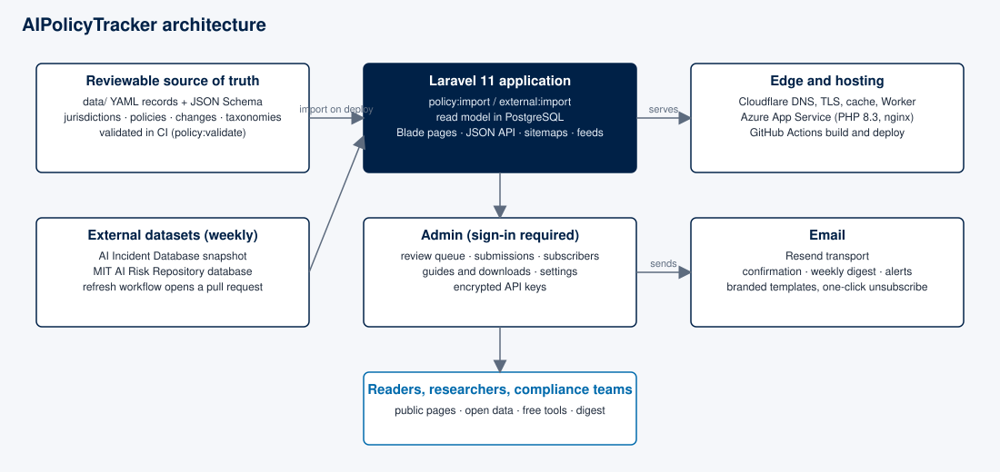
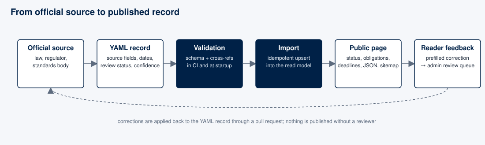
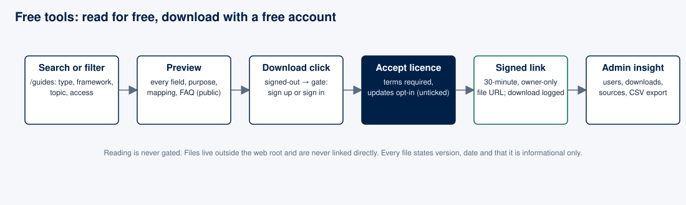

# AIPolicyTracker

**AIPolicyTracker is AI governance intelligence, from regulation to evidence.** Track regulations. Map obligations. Operationalise controls. Prove compliance. Every claim is traceable to its official source: AI policy, verified at the source. Source-backed AI laws, regulations, strategies, standards and guidance across 212 jurisdictions (every UN member state plus territories, sub-national and international bodies), the obligations and deadlines they create, recorded AI incidents and risks, and free templates that help teams act on them.

Live site: [aipolicytracker.org](https://aipolicytracker.org) · Open data: [/open-data](https://aipolicytracker.org/open-data) · Weekly digest: [/subscribe](https://aipolicytracker.org/subscribe)

> **Disclaimer.** Content is informational only and is not legal advice. Check the linked official source and, where needed, qualified counsel before acting on anything shown here.



## What you can do here

| Need | Where |
|------|-------|
| Find every AI instrument in a country or bloc, with status, regulators and official sources | [/jurisdictions](https://aipolicytracker.org/jurisdictions) |
| Read a plain-language record of a law or strategy: scope, dates, obligations, penalties, FAQ, JSON | [/policies](https://aipolicytracker.org/policies) |
| See what organisations must actually do, legal requirements separated from voluntary guidance | [/obligations](https://aipolicytracker.org/obligations) |
| Find the control that meets a duty, every other duty it serves, and the evidence that proves it is operating | [/controls](https://aipolicytracker.org/controls) |
| Compare two to four jurisdictions side by side | [/compare](https://aipolicytracker.org/compare) |
| Follow dated, source-linked changes (RSS and weekly email) | [/changes](https://aipolicytracker.org/changes) |
| Explore recorded AI incidents and the MIT AI Risk Repository, with profiles, charts and exports | [/ai-risk](https://aipolicytracker.org/ai-risk) |
| Screen whether a rule applies to you (educational, not advice) | [/tools/applicability-check](https://aipolicytracker.org/tools/applicability-check) |
| Read practical guides and download free templates, checklists and registers | [/guides](https://aipolicytracker.org/guides) |
| Reuse the dataset (CC BY 4.0) through JSON, CSV, an OpenAPI description and `llms.txt` | [/open-data](https://aipolicytracker.org/open-data) |
| Read the corpus as structured data: every page publishes schema.org JSON-LD, and a binding instrument states whether it is actually in force | any page's `<head>`, [docs](docs/reference/machine-readable-surfaces.md) |
| Report a correction with the record and field prefilled | "Report a correction" on any record |

The related product **Certifyi** ([certifyi.ai](https://certifyi.ai)) is a separate compliance execution platform; AIPolicyTracker is the open, public intelligence layer.

## How records are produced



```
data/
  schema/                 JSON Schema per record type
  taxonomies/terms.yaml   actors, AI system types, sectors, risk categories, use cases, obligation categories
  jurisdictions/*.yaml    one file per jurisdiction
  policies/<j>/*.yaml     one file per policy instrument (sections, obligations, deadlines, sources, FAQ)
  controls/*.yaml         one file per organisational control: evidence, owner, risks, standards clauses
  changes/<year>.yaml     dated change events
```

Every record carries an official source URL, publisher, document date, source tier, `last_checked_at`, `last_verified_at`, review status, confidence level and a content version. `policy:validate` checks schema and cross-references in CI; `policy:import` rebuilds the database from these files on every deploy. External datasets (AI Incident Database, MIT AI Risk Repository) are refreshed weekly through a pull request. See `data/README.md`, `/methodology` and `docs/modules/`.

## Free tools



Guides are free to read. Templates, checklists and registers can be previewed field by field; downloading needs a free account and an explicit licence acceptance, and files are delivered through short-lived personal links. See `docs/modules/guides-and-downloads.md`.

## Plans

The dataset is free and open (CC BY 4.0) for everyone. Pro (monthly or annual) pays for the service around it: follow any policy, jurisdiction or obligation and get one daily email when it changes, plus reminders before application dates fall due. Payments run through Dodo Payments as merchant of record; access is granted only by verified webhooks. Billing is shipped disabled until the provider account is verified. See `docs/modules/billing.md`.

## Tech stack

| Layer | Technology |
|-------|------------|
| Public site and admin | Laravel 11, Blade (server-rendered), Tailwind CSS 3, a small progressive-enhancement script |
| Backend | PHP 8.3, Laravel 11 |
| Database | PostgreSQL in production. The suite runs twice in CI: once on in-memory SQLite for speed, once on PostgreSQL 16 because the two disagree in ways that used to reach production |
| Tooling | Vite 5, ESLint 9, Laravel Pint, PHPUnit 11, GitHub Actions |

## Local setup

Prerequisites: PHP 8.2–8.3 with `pdo_sqlite`, Composer 2, Node 20+.

```bash
git clone https://github.com/8h45k4r/aipolicytracker.git
cd aipolicytracker
composer install
npm ci
cp .env.example .env
php artisan key:generate
touch database/database.sqlite
php artisan migrate --seed
php artisan policy:import
php artisan external:import
npm run dev        # in one terminal
php artisan serve  # in another
```

Useful commands: `php artisan policy:validate`, `php artisan policy:import`, `php artisan external:import`, `php artisan external:sync-aiid`, `php artisan external:sync-aiid-api`, `php artisan external:sync-mit-risk`, `php artisan digest:send --dry-run`, `composer test`, `composer lint`, `npm run lint`, `npm run build`.

`.env.example` lists every variable; nothing deployment-specific is committed.

## Deployment

The application needs a PHP runtime and a PostgreSQL database; a CDN in front handles DNS, TLS and caching. `.github/workflows/deploy.yml` builds and deploys `main`; `azure/` and `Dockerfile` contain the runtime configuration. Operational details live in the `docs/` folder and the workflow files rather than here.

## Contributing

Every change follows the engineering standard in `docs/reference/engineering-standard.md` (inspect first, Analyze → Design → Implement → Test → Validate → Document, nothing claimed working without evidence) and passes five role gates (engineering, UI/UX, documentation, compliance, security) described in `docs/reference/change-gates.md`; module docs live in `docs/modules/`, accepted debt in `docs/reference/technical-debt.md` and the compliance map in `docs/reference/compliance-map.md`.

1. Open an issue using one of the templates (bug, policy data correction, new jurisdiction or source, feature).
2. Fork, branch (`feat/...`, `fix/...`, `data/...`), and for data changes include official source links and a verification status.
3. Make sure `composer lint`, `composer test`, `npm run lint` and `npm run build` pass, then open a pull request with the template.

See `CONTRIBUTING.md`, `SOURCE_ATTRIBUTION.md` and `CODE_OF_CONDUCT.md`. Security issues: private reporting through the repository's *Security* tab (`SECURITY.md`) or bhaskar@aipolicytracker.org.

## Contact

Official address for corrections, partnerships, press and security reports: **[bhaskar@aipolicytracker.org](mailto:bhaskar@aipolicytracker.org)**. Data corrections can also be filed from the "Report a correction" link on any record, and the address is published for automated discovery at `/.well-known/security.txt`.

## License and sources

Code: Apache License 2.0 (`LICENSE`, `NOTICE`). Data: CC BY 4.0, from official or openly licensed sources only. AI incidents: AI Incident Database (Responsible AI Collaborative), CC BY-SA 4.0, McGregor (2021). AI risk taxonomy: MIT AI Risk Repository, CC BY 4.0, Slattery et al. (2025). Third-party libraries keep their own licences.

---

Built by **Dignep Group Pvt. Ltd.** · Powering AI governance for regulated industries · [certifyi.ai](https://certifyi.ai)

Maintained by [Bhaskar Bhatt](https://bhaskar.com.np/), founder and maintainer · [X](https://x.com/8h45k4r) · [LinkedIn](https://www.linkedin.com/in/8h45k4r/)

Follow AIPolicyTracker: [LinkedIn](https://www.linkedin.com/company/aipolicytracker/) · [X](https://x.com/aipolicytracker) · [Facebook](https://www.facebook.com/aipolicytracker) · [Instagram](https://www.instagram.com/aipolicytracker/)
